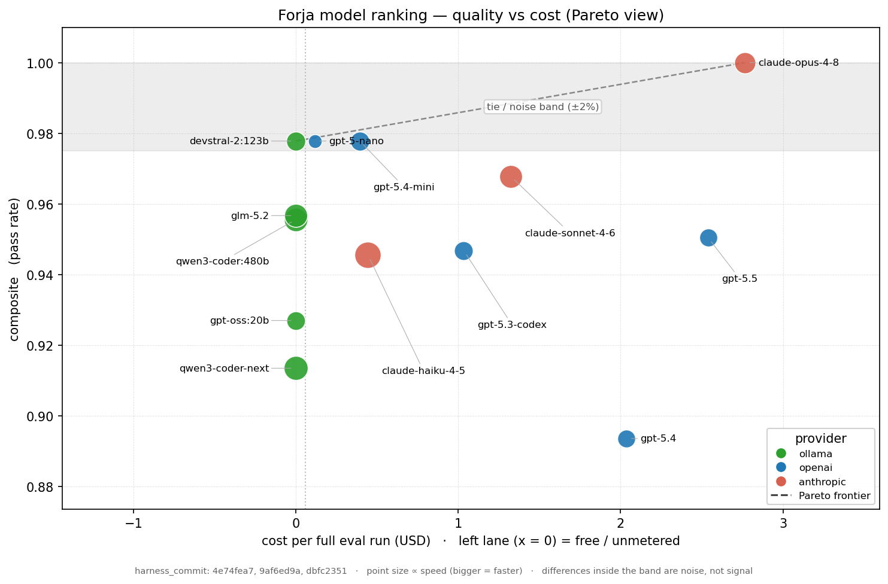

# Model Ranking — Forja

How models perform **inside the Forja harness** — not a general benchmark. It is *measured*: each
model runs the eval suites and is scored on what it actually did in the loop — tool-calling, edit
precision, multi-step execution, recovery, completion. The raw, append-only data lives in [`evals/ranking/results.csv`](../evals/ranking/results.csv);
this page explains how the ranking works — the methodology, not the models in it.

## Current ranking

> Snapshot — **2026-06-21**, the **model-only** set: **35 cases → 51 executions/model**. Commits: `ollama/*`
> on `9af6ed9a`, `openai/*` on `4e74fea7`, `anthropic/*` on `dbfc2351` — the spread is cost-**display** /
> tooling commits, not the eval path, so the case set and run behavior are identical → comparable.
> Repeats: smoke ×2, edit-format ×2, regression ×1 (9·2 + 7·2 + 19·1 = 51). Weights (composite, distinct from
> repeats): smoke ×1, edit-format ×2, regression ×2. Sorted by full-precision composite. Authoritative data:
> [`results.csv`](../evals/ranking/results.csv) (CSV wins). Not comparable to batches before `d79aee58` (the
> case set was reframed — read-file de-weaponized, per-case cost gate swept). The 5 `ollama/*` are
> **unmetered** (subscription, not per token → blank `cost_usd`); the 8 metered rows (`openai/*` + `anthropic/*`)
> report `cost` as the **total metered model cost over the 51 executions** (incl. retries / subagents /
> summaries), measured.
>
> ⚠ **`claude-opus-4-8` tops it outright at 100% — below it the field saturates into a tie.** Opus is the only
> model to **ace all three suites with zero flakes** (smoke / edit-format / regression all 100%, stability
> 100%), so it clears the noise band the rest sit in. For everyone else, `edit-format` and `regression` are
> ~100%, so the composite rides on the 9 `smoke` cases (18 executions); one smoke flip moves it ≈ **1.1 pp**,
> and `regression` runs a single round so one flaky flip is a whole case. Treat scores within ~1–2 pp as
> **effectively tied** — the next tier is an **exact 3-way tie** at 98% (`devstral-2:123b`, `gpt-5-nano`,
> `gpt-5.4-mini`, identical 89 / 100 / 100). 100% also means Opus **maxed the battery**: a harder one (e.g.
> self-SWE-bench) is needed to size its margin over the 98% group.

| # | Model | Composite | smoke | edit-format | regression | steps/case | stable | unfinished | p50 lat | cost | cache |
|---|---|---|---|---|---|---|---|---|---|---|---|
| 1 | `anthropic/claude-opus-4-8` | **100%** | 100% | 100% | 100% | 2.8 | 100% | 0% | 5.7s | **$2.77** | 82% |
| 2 | `ollama/devstral-2:123b` | **98%** | 89% | 100% | 100% | 2.7 | 100% | 0% | 7.8s | unmetered | — |
| 2 | `openai/gpt-5-nano` | **98%** | 89% | 100% | 100% | 3.1 | 88% | 2% | 34.9s | **$0.12** | 66% |
| 2 | `openai/gpt-5.4-mini` | **98%** | 89% | 100% | 100% | 3.0 | 100% | 0% | 7.9s | **$0.39** | 68% |
| 5 | `anthropic/claude-sonnet-4-6` | **97%** | 94% | 100% | 95% | 2.6 | 94% | 0% | 4.6s | **$1.32** | 78% |
| 6 | `ollama/glm-5.2` | **96%** | 89% | 100% | 95% | 2.8 | 100% | 0% | 4.5s | unmetered | — |
| 7 | `ollama/qwen3-coder:480b` | **96%** | 78% | 100% | 100% | 2.8 | 100% | 4% | 4.3s | unmetered | — |
| 8 | `openai/gpt-5.5` | **95%** | 100% | 93% | 95% | 2.8 | 94% | 4% | 9.5s | **$2.54** | 61% |
| 9 | `openai/gpt-5.3-codex` | **95%** | 94% | 100% | 89% | 3.0 | 94% | 6% | 8.2s | **$1.03** | 76% |
| 10 | `anthropic/claude-haiku-4-5` | **95%** | 83% | 100% | 95% | 2.6 | 94% | 0% | 3.2s | **$0.44** | 79% |
| 11 | `ollama/gpt-oss:20b` | **93%** | 78% | 93% | 100% | 3.5 | 94% | 6% | 8.5s | unmetered | — |
| 12 | `ollama/qwen3-coder-next` | **91%** | 78% | 100% | 89% | 2.6 | 100% | 0% | 4.0s | unmetered | — |
| 13 | `openai/gpt-5.4` | **89%** | 89% | 100% | 79% | 3.6 | 88% | 12% | 9.8s | **$2.04** | 68% |

> **`claude-opus-4-8` is the one model outside the tie** (100%, $2.77, p50 5.7s, cache 82%) — it aced every
> suite, including the `regression` multi-tool edits that flaked `gpt-5.4` and the `smoke` cases that separate
> the rest, at stability 100%. It is also the most expensive metered run, which is precisely why it and the
> free `devstral` are the two ends of the Pareto frontier (below).
>
> **The Anthropic trio is a clean capability ladder** — Opus 100% → Sonnet 97% → Haiku 95%, price climbing
> $2.77 / $1.32 / $0.44. Only Opus reaches the frontier; `claude-sonnet-4-6` (97%, $1.32) and
> `claude-haiku-4-5` (95%, $0.44) are both **dominated** (free `devstral` at 98% beats them on quality *and*
> cost). `claude-haiku-4-5` is the **fastest model in the battery** (3.2s p50); its weak spot is skills —
> `skill_invoke` fails **both** rounds (it doesn't reliably follow a loaded skill's body), dragging `smoke` to
> 83%.
>
> **The 8 metered rows are ad-hoc** (run later, not in the standing `ALL_MODELS`; comparable by shared case
> set, not `run_ts`). The OpenAI `cache` 61–76% / Anthropic `cache` 78–82% is why those costs came in as low
> as they did.
>
> **Cheap/small models top the flagships — and that is the saturation artifact, not a verdict.** The top tie
> pairs a free Ollama (`devstral`) with the two **cheapest** OpenAI models (`gpt-5-nano` $0.12, `gpt-5.4-mini`
> $0.39), while `gpt-5.5` ($2.54) and `gpt-5.4` ($2.04) sit *below* them. Read the cause, not the order:
> `gpt-5.5` is the **only model to ace `smoke` (100%)** — strongest on the suite that actually discriminates —
> but it flaked `edit-format` (93%) and `regression` (95%) on single rounds, which the composite punishes; the
> small models simply didn't flake. Do **not** read "nano > gpt-5.5" — cross-check the `smoke` column (or
> `plot_ranking.py --metric smoke`) before ranking capability.
>
> **`gpt-5.4` is last (89%)** on `regression` 79% — multi-tool `edit_file` flows it mostly **passes on
> re-run** (variance, exaggerated by regression's single round); its `unfinished` 12% (it grinds past the step
> cap when it misfires) is the real tell. **Pareto frontier = `devstral` (free, 98%) ↔ `claude-opus-4-8`
> ($2.77, 100%)**: free-and-near-perfect, or perfect-but-paid — the two non-dominated picks. Everything else is
> below-and-right of that line (`gpt-5-nano` at the same 98% as `devstral` is dominated by it on cost; every
> paid flagship is dominated on quality). The cost × quality chart is
> [`scripts/plot_ranking.py`](../scripts/plot_ranking.py) (see [`plot_ranking.md`](../scripts/plot_ranking.md)).
>
> **Smallest viable Ollama model is `gpt-oss:20b` (20B, cloud).** Local small models were retired (~2% each):
> `qwen2.5-coder:7b` emits no native `tool_calls` via Ollama (1 step), `llama3.1:8b` is too slow (~180s/read
> → timeout). Ollama Cloud serves nothing under ~20B.



*Regenerated from [`results.csv`](../evals/ranking/results.csv) with [`scripts/plot_ranking.py`](../scripts/plot_ranking.py) — see [`plot_ranking.md`](../scripts/plot_ranking.md). Top-left is best; the grey band is the tie/noise zone; `x=0` is free/unmetered.*

---

## How the ranking is built

### What it measures

Behavior in **this** harness, not a leaderboard. The value is exactly that public benchmarks don't
capture how a model drives Forja's loop — does it call the right tool, produce an edit that applies
cleanly, recover from a failure, finish before the step cap.

**Scope: model-sensitive cases under a fixed Forja harness** — NOT model isolation. Every result still
rides on the system prompt, tool schemas, error messages, step cap, context builder, provider adapter,
sampling / reasoning effort, and loop behavior; those are held fixed, not removed. What the ranking does
is drop cases whose outcome is *purely* determined by the harness: each case is tagged `evaluates: model`
(default) or `evaluates: harness`, and only `model` cases run. `harness` cases (permissions, hooks,
compaction, postures) score the same regardless of model — they don't discriminate, and some (compaction)
actively misled via window artifacts. They still run in CI as harness regression. Current split:
**35 model** / 25 harness.

### The unit: a case (pass/fail)

Each suite is a set of YAML cases. A case declares **expectations** — e.g. `tool_called`,
`output_contains`, `file_exists` / `file_contains`, `compaction_triggered`. The harness runs the
model for real (`executeCase`) and checks them.

> **Rule:** a case passes only if **every** expectation passes — all-or-nothing.

### The dimensions (suites)

Cases = the **model** subset the ranking runs (the suite dirs hold more; `harness` cases are filtered).

| Suite | Cases | What it probes | Weight | Repeat |
|---|---|---|---|---|
| `smoke` | 9 | baseline competence in the loop (read/write/edit/grep/glob/skill/parallel) | ×1 | 2 |
| `edit-format` | 7 | **producing valid edits** (`edit_file`) — the coding skill | ×2 | 2 |
| `regression` | 19 | harder, broader competence (multi-tool flows, recovery, safety, anti-hallucination) | ×2 | 1 |

`edit-format` and `regression` weigh ×2 because, for a coding agent, producing valid edits and
holding up on harder cases matter more than the baseline. Small suites repeat (variance); `regression`
already has a stable N at repeat 1.

### Metrics

**Per suite:** `passRate = passed / total` (over its repeats).

**Composite** (the sort key) — the weighted mean of suite pass-rates:

```
composite = Σ(passRate_suite × weight_suite) / Σ(weights)
```

Worked example — why a model can lead on one suite yet rank lower. With two suites
(`smoke` ×1, `edit-format` ×2):

```
70% smoke, 88% edit-format → (0.70×1 + 0.88×2) / 3 = 82%
90% smoke, 50% edit-format → (0.90×1 + 0.50×2) / 3 = 63%   # high smoke, but edit-format (×2) dominates
```

A strong score on a lightly-weighted dimension does not win if a heavily-weighted one is weak.

**Separate axes** (reported beside the composite, **never folded into it** — passing efficiently is
not the same as passing):

- **`steps/case`** — efficiency. Fewer steps to the same result is better; it differentiates models
  even when cost is $0.
- **`stability`** — % of repeated cases that returned the SAME verdict every round (consistency, NOT
  competence: a case that fails all rounds also counts as stable). Read it *with* pass-rate — high
  stability + low pass-rate = consistently wrong. Only counts cases that ran ≥2 rounds. *(A future split
  into stable-pass / unstable / stable-fail would separate predictability from competence.)*
- **`unfinished`** — % of runs that hit the step cap, were cut off, or errored (reliability),
  independent of pass/fail.
- **`p50 latency`** and **cost** — `cost_usd` is a real number for per-token-billed providers, and
  **blank** for **unmetered** ones (e.g. Ollama Cloud — billed by subscription / GPU-time, not per
  token; "untracked", NOT "$0 / free"). When cost is flat or blank, latency separates models. Note: a
  cost cap (`maxCostUsd`) cannot bound an unmetered model — bootstrap warns when one is set.
- **`cache_read_rate`** — fraction of prompt tokens served from a cache read (the prompt-cache hit
  rate). Filled only when the provider caches; **blank** for providers that don't (e.g. Ollama), so
  it reads as "n/a" rather than "0% hit". Like cost, it only matters once a caching model (e.g.
  Anthropic) is in the battery.

### Rules (summary)

1. Case = **pass/fail** (all expectations or nothing).
2. Suite `passRate` = passed / total (× repeats).
3. `composite` = weighted mean of suite pass-rates.
4. **Rank = full-precision composite, descending.** Displayed `%` are rounded, so two rows can show the
   same number without tying; only **exact** full-precision ties share a rank (hence repeated rank
   numbers). Within ~1–2 pp, read as tied regardless of rank (the battery saturates at the top).
5. Efficiency/trust/latency/cost are **reported, not ranked** — weigh them yourself (a faster, more
   reliable 80% can beat a flaky 85%).
6. Repeats raise trust; tune them per suite.

### What it does NOT consider

Model size / parameters, headline price, advertised context window, public benchmarks, vibes. Only
measured behavior in the harness.

## Relation to the benchmark

[`BENCHMARK.md`](BENCHMARK.md) measures **capability** — can a model fix a real bug, verified by the
project's own tests (the per-tier pass-rate of real fixes). This ranking measures **loop behavior** —
does the model call the right tool, produce a clean edit, recover, finish, across fixed suites. They are
**separate axes**: a model can drive the loop cleanly (high ranking) yet clear few hard real fixes (low
capability), or the reverse. Neither is folded into the other — reported side by side, weighed by the
reader.

## Data & reproducibility

- **`evals/ranking/results.csv`** is the source of truth — **append-only**, one row per
  `(run, model)`, with `run_date`, `run_ts`, and `harness_commit` columns. No run is ever lost;
  build charts / pivots / summaries downstream from it.
- **Comparability key = `harness_commit` + the case set**, not `run_ts` alone. A batch shares a `run_ts`,
  but runs added later (e.g. the `openai/*` rows above) are still comparable if they share the commit and
  the model-only case set — `run_ts` is an operational id, not a methodological one. Do not average across
  harness versions. *(A `comparison_group` keyed on commit + case-manifest-hash + config-hash would make
  this explicit; deferred until the bench runs as recurring CI.)*
- This page's snapshot table is a hand-refreshed view; when it and the CSV disagree, **the CSV wins**.

## Running it

```bash
# Run the battery against the configured models → append a batch to the CSV
bun run scripts/model-ranking.ts

# Override repeat for the small suites (regression stays at 1)
RANKING_REPEAT=3 bun run scripts/model-ranking.ts

# Append an existing results.json to the CSV without re-running
RANKING_INGEST=1 bun run scripts/model-ranking.ts
```

Models and suites (with weights and repeats) are configured at the top of
[`scripts/model-ranking.ts`](../scripts/model-ranking.ts) — adding a model is one line in `MODELS`,
and the ranking takes any number of them. (Paid models bill real money, so set a budget first.)
